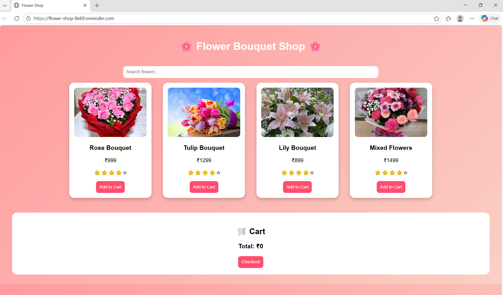
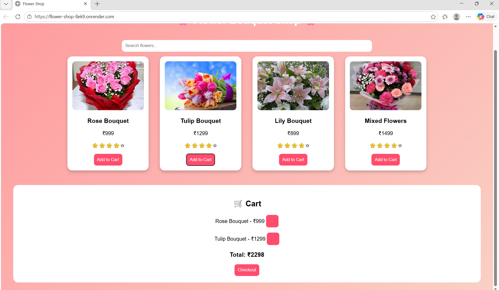
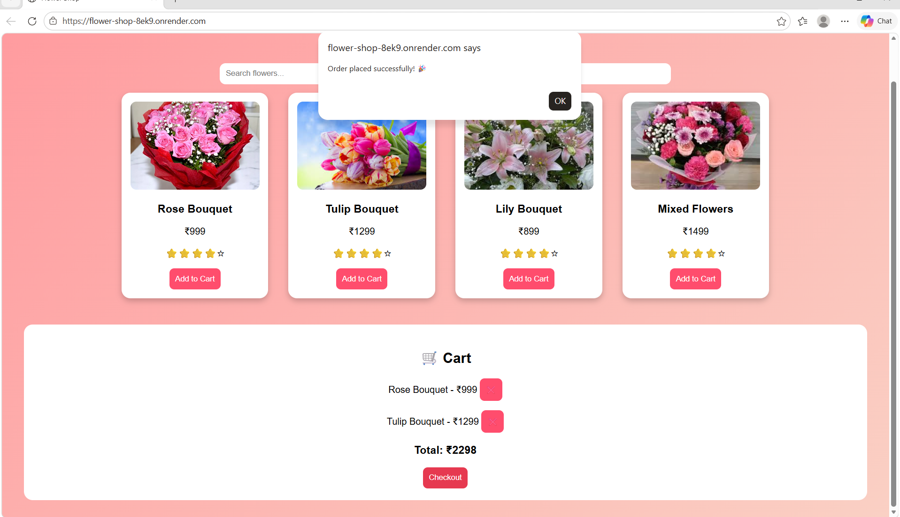

#  Flask Docker Flower Shop

A full-stack flower bouquet e-commerce web application built using Flask and deployed using Docker & Render.

---

##  Live Demo

 https://flower-shop-8ek9.onrender.com

---

##  Project Overview

This project is a complete end-to-end web application where users can browse flower bouquets and add them to a cart.
The application is fully containerized using Docker and deployed on the cloud using Render.

---

##  Features

*  Beautiful flower bouquet listings
*  Add to cart functionality
*  Dynamic pricing system
*  Responsive and attractive UI
*  Fast loading with Flask backend
*  Live deployment using Render

---

##  Tech Stack

###  Frontend

* HTML
* CSS
* JavaScript

###  Backend

* Python
* Flask

###  DevOps & Deployment

* Docker
* Docker Hub
* Render

---

##  Architecture

Client (Browser)
⬇
Flask Application (Backend)
⬇
Docker Container
⬇
Render Cloud Deployment

---

##  Project Structure

```
flower-shop/
├── app.py
├── Dockerfile
├── requirements.txt
├── templates/
│   └── index.html
├── static/
│   ├── images/
│   ├── css/
│   └── js/
```

---

##  Docker Setup

### Build Docker Image

```
docker build -t flower-shop .
```

### Run Container

```
docker run -p 5000:5000 flower-shop
```

---

##  Deployment

* Docker image pushed to Docker Hub
* Deployed using Render cloud platform
* Publicly accessible via live URL

---

##  Challenges Solved

*  Fixed ARM vs AMD architecture issue
*  Implemented Docker buildx for compatibility
*  Containerized full-stack application
*  Successfully deployed live project

---

##  Screenshots

## Screenshots

### Home Page


### Products Page


### Cart Page


---

##  Future Enhancements

*  User authentication (Login/Signup)
*  Payment integration (Razorpay/Stripe)
*  Database integration (MongoDB/MySQL)
*  Order history system

---

##  Author

**Sowmya Vankayalapati**
 BTech Student (2027)
 Web Developer | DevOps Enthusiast

---

##  Conclusion

This project demonstrates real-world skills in full-stack development and DevOps, including building, containerizing, and deploying applications.

---
